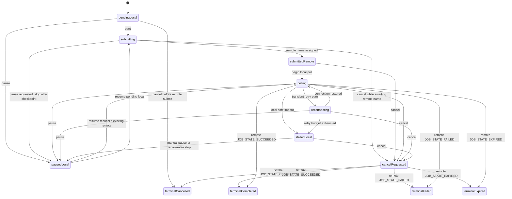

# PRD: Queue Pause, Resume, and Cancel

Status: Draft  
Date: 2026-04-03  
Product area: Queue / Batch Orchestration  
Primary code paths: `Nano Banana Helper/Services/BatchOrchestrator.swift`, `Nano Banana Helper/Views/ProgressQueueView.swift`, `Nano Banana Helper/Services/NanoBananaService.swift`

## 1. Summary

The Queue controls currently blur three different concepts:

1. Local UI pause state
2. Local polling timeout recovery
3. Remote Gemini batch cancellation

This causes misleading UX and real correctness bugs:

- `Pause` currently sets a local flag but does not stop submissions or polling.
- `Resume` is not a reliable inverse of `Pause`.
- `Cancel` mutates local tasks immediately, but Gemini cancel is asynchronous and best-effort.
- Cancelling during submission can race with late-arriving remote batch names.
- Global cancel clears in-memory batches, but can leave persisted queue state behind.

This PRD defines a correct, source-backed MVP for Queue control semantics:

- `Pause` means local pause only.
- `Resume` means local resume plus reconciliation of remote jobs already submitted.
- `Cancel` means stop future local work, request remote batch cancellation where possible, and reconcile to actual terminal state before finalizing the queue.

## 2. Problem

Users need reliable control over long-running batch jobs. Today the app can display `Paused` without actually pausing work, and can display `Cancelled` before the Gemini batch has really become cancelled.

That creates four classes of failure:

1. Trust failure: the UI says one thing while the system does another.
2. Duplicate-work failure: resume/retry paths can accidentally create new remote jobs.
3. Lost-state failure: app restart or cancel can leave queue persistence inconsistent.
4. Accounting/history failure: final history can reflect local intent instead of actual remote outcome.

## 3. Current Findings

Observed from the current codebase on 2026-04-03:

- `BatchOrchestrator.pause()` sets `isPaused = true` and `statusMessage = "Paused"`, but `isPaused` is not consulted in submission or polling workers.
- `ProgressQueueView` swaps toolbar buttons based on `isRunning` vs `isPaused`, but `pause()` does not stop active work, so the queue can still appear effectively running.
- `cancel(batch:)` immediately marks local tasks failed with `"Cancelled by user"` and fires remote cancels in the background.
- Remote cancel requests are issued only for tasks that already have `externalJobName` values at cancel time.
- A task cancelled during `.submitting` can still receive a late `externalJobName`, leaving an un-cancelled remote job.
- Global `cancel()` persists each per-batch cancellation snapshot, then clears `activeBatches` in memory without persisting the final empty state, which can leave `active_batch.json` stale.
- The only existing automated coverage found is one test for cancelling a `.submitting` task's local state. No pause/resume coverage exists.

## 4. External Constraints From Gemini API

The design must follow current official Gemini Batch API behavior.

### 4.1 Confirmed constraints

- Gemini supports `batches.cancel` via `POST /v1beta/{name=batches/*}:cancel`.
- Cancel is asynchronous and best-effort, not guaranteed.
- Clients must poll the batch afterward to determine whether cancellation succeeded or whether the batch completed despite cancellation.
- The batch is not deleted when cancellation succeeds.
- `batches.get` is the authoritative way to poll current batch state.
- Terminal states documented in the guide are:
  - `JOB_STATE_SUCCEEDED`
  - `JOB_STATE_FAILED`
  - `JOB_STATE_CANCELLED`
  - `JOB_STATE_EXPIRED`
- `JOB_STATE_EXPIRED` means the batch was pending or running for more than 48 hours and has no retrievable results.
- Batch jobs are designed for a 24-hour turnaround target, but actual completion varies.
- Batch creation is not idempotent. Repeating the same create request creates a second batch job.
- After completion, clients should inspect `batchStats.failedRequestCount` and parse per-line outputs for mixed success/error results when using file output.

### 4.2 Documentation conflict

There is an official-doc conflict about delete semantics:

- The guide says deleting a batch job stops processing new requests.
- The API reference says `batches.delete` does not cancel the operation and only indicates the client is no longer interested in the result.

Decision for this PRD:

- Do not use `batches.delete` for Queue cancel behavior.
- Treat `batches.cancel` plus `batches.get` reconciliation as authoritative.
- Consider delete out of scope for this feature until Google resolves the documentation conflict.

## 5. Goals

1. Make Pause, Resume, and Cancel honest and deterministic.
2. Prevent new remote work from starting after a pause or cancel request.
3. Reconcile local state to actual Gemini batch state instead of assuming outcomes.
4. Survive app restart without losing control state or duplicating remote jobs.
5. Preserve correct history, status, and cost reporting.

## 6. Non-Goals

1. No server-side pause, because Gemini exposes no pause endpoint.
2. No broad queue redesign outside Pause/Resume/Cancel semantics.
3. No delete-based cleanup flow.
4. No per-request remote cancellation inside a Gemini batch beyond batch-level cancel.

## 7. Product Principles

1. Never imply remote pause exists when it does not.
2. Never show final cancellation until Gemini has been reconciled or the app has exhausted a clearly defined cancel-confirmation flow.
3. Never create a second remote batch because Resume or recovery guessed wrong.
4. Prefer explicit intermediate states over optimistic lies.

## 8. User Stories

1. As a user, when I click Pause, I expect the app to stop starting new work immediately and stop actively polling until I resume.
2. As a user, when I click Resume, I expect the app to pick up from known remote jobs first and only then continue pending local work.
3. As a user, when I click Cancel, I expect no new work to start and any already-submitted remote work to be cancellation-requested and reconciled correctly.
4. As a user, if I quit and relaunch, I expect paused, cancelling, or interrupted batches to recover without duplication.
5. As a user, I expect the queue and history to distinguish `cancel requested`, `cancelled`, `completed`, `failed`, and `expired`.

## 9. Scope

### In scope

- Queue header controls in `ProgressQueueView`
- Orchestrator state machine in `BatchOrchestrator`
- Gemini batch reconciliation in `NanoBananaService` integration
- `resumePollingFromHistory(for:)` and any other resume entry point that can re-activate remote work
- Direct-tier, non-batch submissions that flow through the same queue orchestration path
- Persistence of pause/cancel/recovery state
- History/state updates for terminal outcomes
- Tests for pause, resume, cancel, recovery, and race conditions

### Out of scope

- New batch scheduling features
- Cross-device sync
- Server-hosted queue management
- Background daemon work outside the current app lifecycle

## 10. Proposed UX

### 10.1 Pause

Button label remains `Pause`, but supporting copy must clarify:

- "Pause stops local submission and polling. Gemini may continue processing already-submitted batches remotely."

Behavior:

- Stop starting any new submissions immediately.
- Stop active local polling loops at the next safe checkpoint.
- Persist paused state.
- Show `Paused locally` in queue status, not just `Paused`.
- Show counts:
  - pending not submitted
  - submitted awaiting resume/reconcile

### 10.2 Resume

Behavior:

1. Clear local paused state.
2. Reconcile all known remote jobs first via `batches.get`.
3. For remote jobs still non-terminal, restart polling.
4. For pending local tasks with no remote batch name, resume submission only after reconciliation begins.
5. Make Resume idempotent. Double-clicking Resume must not create duplicate batches.
6. Any resume entry point, including `resumePollingFromHistory(for:)`, must use this same reconciliation path instead of bypassing it.

### 10.3 Cancel

Behavior:

1. Change control state to `Cancelling`.
2. Stop submitting new work immediately.
3. For tasks with remote batch names, send `batches.cancel`.
4. For tasks still submitting without a remote batch name yet, record cancel intent and issue cancel immediately if a name arrives later.
5. Poll or reconcile remote state until each known remote task reaches terminal state or the app enters a recoverable interrupted state.
6. Finalize each task by actual outcome:
  - `cancelled` if Gemini confirms cancelled
  - `completed` if Gemini completed despite cancellation
  - `failed` if Gemini failed
  - `expired` if Gemini expired
7. Only local-only tasks with no remote submission may finalize as `cancelled` immediately.
8. For non-batch direct-tier requests, there is no Gemini batch cancel endpoint. Cancel applies before request start; once a direct request is in flight, the app may only stop follow-on local work and reconcile the eventual response locally.

### 10.4 Copy requirements

Use explicit wording:

- `Paused locally`
- `Cancel requested`
- `Cancelled remotely`
- `Completed before cancel took effect`
- `Expired remotely`

Do not use `Cancelled` as soon as the user clicks the button unless the task never left the local queue.

## 11. Proposed State Model

The current model overloads `status`, `phase`, `isPaused`, and soft-timeout `stalled` semantics. This feature should separate queue control state from remote execution state.

### 11.1 Queue-level control state

- `idle`
- `running`
- `pausedLocal`
- `resuming`
- `cancelling`
- `interrupted`

### 11.2 Task-level local execution state

- `pendingLocal`
- `submitting`
- `submittedRemote`
- `polling`
- `pausedLocal`
- `cancelRequested`
- `reconnecting`
- `stalledLocal`
- `terminalCompleted`
- `terminalCancelled`
- `terminalFailed`
- `terminalExpired`

Notes:

- `submittedRemote` is a new explicit state inserted after the remote batch name is assigned and before active polling resumes. The current code jumps directly from `.submitting` to `.polling`; this PRD requires that intermediate state to exist.
- Current `JobPhase.reconnecting` remains valid and should be preserved as an implementation phase under the new model.
- Current `JobPhase.stalled` should be renamed or mapped to `stalledLocal` to make clear that the pause is local and caused by reconciliation timeout, not a remote Gemini pause primitive.

### 11.3 Remote batch state mapping

- Gemini `JOB_STATE_PENDING` -> local `submittedRemote` or `polling`
- Gemini `JOB_STATE_RUNNING` -> local `polling`
- Gemini `JOB_STATE_SUCCEEDED` -> local `terminalCompleted`
- Gemini `JOB_STATE_CANCELLED` -> local `terminalCancelled`
- Gemini `JOB_STATE_FAILED` -> local `terminalFailed`
- Gemini `JOB_STATE_EXPIRED` -> local `terminalExpired`

### 11.4 State machine

## 12. Functional Requirements

### FR-1 Pause must actually stop local work

- No new task submission may begin after pause is requested.
- Existing local polling loops must stop at the next safe boundary.
- Pause must be persisted so app relaunch preserves local paused state.
- Pause must not send remote cancel.

### FR-2 Resume must reconcile before creating new remote work

- Resume must first inspect all tasks with known remote batch names.
- Resume must not create a second remote batch for any task that already has a known remote batch name.
- Resume must be safe to retry if the app crashes mid-resume.
- `resumePollingFromHistory(for:)` must route through the same reconcile-before-submit path and must not bypass queue control state.

### FR-3 Cancel must be intent-first, terminal-state-second

- Cancel request must stop future local work immediately.
- Tasks with no remote batch name may finalize as local-cancelled immediately.
- Tasks with a remote batch name must enter `cancel requested` until reconciliation completes.
- Final local state must reflect actual Gemini outcome, not assumed cancellation.

### FR-4 Cancel during submission must be race-safe

- If cancel is requested while `startBatchJob` is in flight, the orchestrator must remember that cancellation is pending for that task.
- If a remote batch name arrives after cancel was requested, the app must immediately call `batches.cancel`.
- The task must not be treated as fully cancelled until reconciliation confirms the final remote state.

### FR-5 Stalled polling and manual pause must converge

- Current soft-timeout `stalled` behavior must be folded into the same resume/reconcile path as manual pause.
- Users should see one recovery action, not separate hidden control models.
- `Resume Batch` and toolbar `Resume` must share the same orchestrator path.
- `reconnecting` remains a transient implementation phase, but it must respect pause/cancel checkpoints and converge into the same recovery path if it cannot recover.

### FR-6 Persistence must be complete and deterministic

- Persist queue control state, task control state, remote batch name, timestamps, and pending cancel intent.
- Global cancel must persist the final queue state, including an empty queue if all tasks are removed.
- Recovery after relaunch must not depend on transient in-memory flags such as today's `isPaused`.

### FR-7 History must reflect final truth

- History entries must not be finalized as `cancelled` for remote-submitted tasks until reconciliation determines the terminal Gemini state.
- If a batch completes despite cancel request, history must record `completed`.
- If Gemini returns cancelled, history must record `cancelled`.
- If Gemini expires, history must record `expired`.
- Submission-time `"processing"` entries created when a remote batch name is assigned must be updated through the same reconciliation path, using `onHistoryEntryUpdated` or its successor, rather than left as optimistic placeholders.

### FR-8 Direct-tier queue behavior must be explicit

- Direct-tier `editImage` requests share the queue orchestration path and must obey pause/resume/cancel checkpoints before request start.
- Pause must prevent new direct-tier requests from starting.
- Cancel must prevent new direct-tier requests from starting.
- Because the current direct-tier path has no documented remote cancel primitive, in-flight direct-tier requests are recoverable locally but are not treated as remotely cancellable.

## 13. Edge Cases

1. Pause clicked while nothing is running.
Expected: no-op, stable UI.

2. Pause clicked twice.
Expected: idempotent, no duplicate state transitions.

3. Resume clicked twice.
Expected: only one resume/reconcile flow runs; no duplicate submissions or pollers.

4. Cancel clicked twice.
Expected: idempotent; duplicate remote cancel requests are tolerated or suppressed.

5. Pause while tasks are still only local pending.
Expected: all remain local pending and unsent.

6. Pause while some tasks are submitting and others are pending.
Expected: no new submissions start; submitting tasks finish their current request boundary, then become paused/reconcilable.

7. Pause while polling.
Expected: polling stops locally, remote Gemini jobs may continue, UI explains that clearly.

8. Resume after remote work completed during pause.
Expected: resume reconciles to terminal state without re-submitting.

9. Cancel before any remote submission.
Expected: immediate local cancellation.

10. Cancel after remote submission but before first poll.
Expected: send `batches.cancel`, then reconcile by polling.

11. Cancel during submission before remote batch name returns.
Expected: queue records cancel intent and cancels immediately once the name arrives.

12. Cancel request succeeds but Gemini completes anyway.
Expected: final local status is completed, with copy explaining cancel did not take effect in time.

13. Cancel request fails due to network error.
Expected: queue remains `cancel requested` / recoverable and retries or allows explicit retry on next resume.

14. App quits during paused state.
Expected: paused state restores exactly on launch.

15. App quits during cancelling state.
Expected: launch restores `cancel requested` / interrupted state and continues reconciliation rather than forgetting the request.

16. Batch expires remotely after long runtime.
Expected: local terminal state becomes expired; no result download attempt.

17. Partial result batch with some request-level errors.
Expected: batch-level success is not enough; result parsing and history must surface mixed outcomes where supported.

18. Duplicate create attempt during resume or recovery.
Expected: prevented by persisted remote batch names and explicit no-resubmit rule.

19. Persisted queue file says paused, but some tasks are already terminal.
Expected: load normalizes terminal tasks and only pauses remaining active/reconcilable work.

20. Queue cancelled globally while one batch is already completed.
Expected: completed tasks remain completed and are not rewritten as cancelled/failed.

21. User resumes a job from History.
Expected: `resumePollingFromHistory(for:)` enters the same reconciliation path as queue Resume and does not create duplicate remote work.

22. Pause/cancel on direct-tier, non-batch work before the request starts.
Expected: the request never starts.

23. Cancel on direct-tier work after the request has already started.
Expected: no follow-on local work starts; the eventual result is reconciled locally because there is no batch cancel endpoint in this path.

## 14. Requirements for Implementation

### 14.1 Orchestrator

- Replace the current single `isPaused` flag with persisted control state.
- Introduce explicit checkpoints in submission and polling loops.
- Ensure `startAll()` and recovery paths respect queue control state.
- Ensure reconciliation logic is reusable for:
  - app launch recovery
  - manual resume
  - post-cancel confirmation
- Route `resumePollingFromHistory(for:)` through the same reconciliation code path instead of constructing a sidecar resume flow.
- Preserve a transient reconnecting phase for network recovery, but make it subordinate to the same pause/cancel state machine.

### 14.2 Service layer

- Keep using `batches.cancel` and `batches.get`.
- Do not introduce `batches.delete` into queue control flow.
- Treat cancel response as request acceptance, not proof of terminal cancellation.
- Expose clear error surfaces for cancel and reconciliation failures.
- Do not invent a cancel primitive for direct-tier `generateContent` / `editImage` requests when no corresponding Gemini operation endpoint exists in the current integration.

### 14.3 UI

- Update control labels and status badges to distinguish:
  - local pause
  - local cancel request
  - terminal remote cancel
  - terminal remote completion
- Avoid presenting `Pause` and `Resume` from two different state machines.
- Consider disabling conflicting controls while `resuming` or `cancelling`.
- Rework `StatusIndicator` to render queue control state from an explicit enum rather than the current `isRunning` / `isPaused` booleans.
- Extend task-phase presentation in `Models.swift` and `TaskRowView` for `submittedRemote`, `pausedLocal`, `cancelRequested`, `stalledLocal`, and `terminalExpired` or their final chosen equivalents.

### 14.4 Persistence

- Save after every meaningful control transition.
- Persist enough metadata to recover without guessing.
- Remove persisted queue file only when the queue is truly empty and terminal reconciliation is complete.

### 14.5 History integration

- Keep the existing submission-time processing history entry pattern only if terminal reconciliation always updates it.
- Reconciliation must be the single authority for terminal history updates after pause, resume, cancel, reconnect, and recovery-on-launch.
- Avoid writing terminal `cancelled` history for remote-submitted work before Gemini terminal state is known.

## 15. Telemetry and Logging

Add structured logs for:

- pause requested
- pause entered
- resume requested
- resume reconciliation started/completed
- cancel requested
- remote cancel sent
- remote cancel acknowledged by terminal state
- cancel completed despite request
- recovery after relaunch

Minimum counters:

- number of batches paused locally
- number of resumes with no duplicate create
- number of cancel requests ending as cancelled
- number of cancel requests ending as completed anyway
- number of recovered interrupted queues

## 16. Acceptance Criteria

1. Clicking `Pause` prevents any new submission from starting.
2. Clicking `Pause` causes active polling loops to stop locally within one poll interval or less.
3. Clicking `Resume` after pause does not create duplicate remote jobs.
4. Clicking `Resume` reconciles remote-submitted jobs before submitting local pending tasks.
5. Clicking `Cancel` stops new submissions immediately.
6. Clicking `Cancel` during submission still cancels late-arriving remote jobs.
7. Remote-submitted tasks are not marked terminal-cancelled until Gemini terminal state is known.
8. If Gemini reports `JOB_STATE_SUCCEEDED` after cancel request, the task finishes as completed, not cancelled.
9. If Gemini reports `JOB_STATE_CANCELLED`, the task finishes as cancelled.
10. If Gemini reports `JOB_STATE_EXPIRED`, the task finishes as expired.
11. App relaunch restores paused, cancelling, and interrupted queues without duplicate remote creation.
12. Global cancel persists the final empty-queue state correctly.

## 17. Test Plan

### Unit tests

- pause toggles control state and stops new submissions
- resume clears paused state and starts reconciliation
- cancel sets cancel intent without optimistic terminal rewrite for remote-submitted jobs
- cancel-during-submission issues remote cancel when name arrives later
- load/save round-trip for paused, cancelling, interrupted queues
- `resumePollingFromHistory(for:)` uses the shared reconciliation path
- direct-tier work respects pause/cancel before request start
- update or replace the current `cancelHandlesSubmittingPhaseTasks` test so it asserts the new intent-first behavior instead of the current immediate-failed behavior

### Integration tests

- pause during polling, then resume to successful completion
- pause during submission, then resume without duplicate batch creation
- cancel submitted batch, remote returns cancelled
- cancel submitted batch, remote returns succeeded despite cancel
- cancel submitted batch, remote returns expired
- relaunch during cancelling and reconcile on startup
- resume from History on an existing remote job without duplicate batch creation
- direct-tier request paused/cancelled before submission never starts

### UI smoke tests

- header buttons render correct combinations for running, paused locally, resuming, cancelling, interrupted
- task rows show accurate copy for paused locally, cancel requested, cancelled, expired

## 18. Rollout Notes

Ship this behind a narrow implementation scope:

1. Correct orchestrator semantics
2. Correct persistence
3. Correct UI copy
4. Test coverage

No additional feature work should be bundled into this change.

## 19. Open Questions

1. Should completed-before-cancel tasks show a distinct badge or only a detailed history note?
2. Should mixed per-request failures in batch result files appear as `completed with errors` at batch level?

Resolved for this PRD:

- `resumePollingFromHistory(for:)` is in scope and must use the shared reconcile-before-submit path.
- `stalled` is folded into a clearly local `stalledLocal` concept, while `reconnecting` remains as a transient implementation phase that still obeys the same control model.
- Direct-tier, non-batch queue work is in scope for pause/cancel gating before request start, but is not treated as remotely cancellable through Gemini batch APIs.
- Queue-level UI cancel remains global for this release. Existing `cancel(batch:)` may remain as an internal orchestration API, but exposing per-batch cancel in UI is out of scope.

## 20. References

Official Google Gemini docs used for this PRD:

1. Gemini Batch API guide: <https://ai.google.dev/gemini-api/docs/batch-api>
   - Last updated on page: 2026-03-25 UTC
   - Relevant sections:
     - Monitoring job status
     - Cancelling a batch job
     - Deleting a batch job
     - Technical details / Best practices

2. Gemini Batch API reference: <https://ai.google.dev/api/batch-api>
   - Relevant methods:
     - `batches.get`
     - `batches.cancel`
     - `batches.delete`

Key doc-backed facts incorporated here:

- `batches.cancel` is best-effort and must be reconciled afterward.
- `batches.get` is the polling/reconciliation primitive.
- Terminal states include `SUCCEEDED`, `FAILED`, `CANCELLED`, and `EXPIRED`.
- Expired batches can have no retrievable results after more than 48 hours pending/running.
- Batch creation is not idempotent.
- There is a current guide/reference conflict on delete semantics, so delete is excluded from this feature design.
